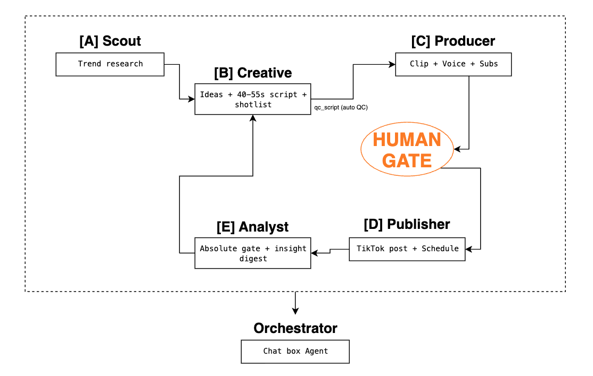

# VNG Channel Agent

> A multi-agent system that runs a social channel end-to-end: it scouts trends, writes
> a 40–55s script, voices it, edits a video from a library of real footage, posts it
> to TikTok, reads the real metrics, and feeds what it learned back into the next round.
> **The AI executes and learns; a human decides what to scale.** Its first live channel is
> **VNG Insider** — VNG's employer-branding channel.

---

## Demo

[](https://vngms-my.sharepoint.com/:v:/g/personal/nghitp_vng_com_vn/IQBge4km5ZpwRaTTC78YIDTbAbgfpt1wMidM5iXB_i2a_Ok?e=Zd1TO8&nav=eyJyZWZlcnJhbEluZm8iOnsicmVmZXJyYWxBcHAiOiJTdHJlYW1XZWJBcHAiLCJyZWZlcnJhbFZpZXciOiJTaGFyZURpYWxvZy1MaW5rIiwicmVmZXJyYWxBcHBQbGF0Zm9ybSI6IldlYiIsInJlZmVycmFsTW9kZSI6InZpZXcifX0%3D)


**Live on AgentBase:** https://endpoint-fea0973b-339d-4f7b-89d1-25e769efd4b0.agentbase-runtime.aiplatform.vngcloud.vn

> Open the **Workflow** tab → enter a topic → watch the A→E pipeline run live, approve at
> the human gate, and inspect each step's output.

### Limitations

- **Per-channel TikTok connection.** To publish, the agent connects to a *specific* TikTok
  channel via that channel's TikTok App credentials — a **Client Key** + **Client Secret**
  (`TIKTOK_CLIENT_KEY` / `TIKTOK_CLIENT_SECRET`). It runs OAuth once to obtain a per-channel
  access token (saved in `tokens.json` and auto-refreshed via the refresh token).
- **This demo posts to the team's channel only.** Here the agent uses our team's own Client
  Key + Client Secret, so it can only post to that channel. To run it for another channel or
  BU, just swap in that channel's Client Key + Client Secret and re-authorize — no code
  changes needed.
- **Sandbox mode → SELF_ONLY posts.** The TikTok App is still in sandbox mode, so for an
  unaudited client the publish is forced to `SELF_ONLY` (private, visible only inside the
  team's account) — which is still enough to prove the agent posts for real.

> 👉 Watch the demo video above to see exactly how the agent publishes a video to TikTok.

---

## Problem

Across VNG, the need for a social channel shows up almost everywhere: game teams need a
channel to grow their community, HR needs employer branding, and individual BUs want more
brand awareness — or just a place to test new formats on TikTok, Reels, and Shorts.

The catch is people. Few teams have the headcount to run the full loop — spotting a trend,
shaping an idea, writing a script, editing the video, posting it, and then reading the
numbers. So channels get opened fast but are hard to keep alive: content comes and goes,
videos are made on gut feel, trends are caught only after they have passed, and the team is
already overloaded.

The result: channel-building stays a manual, headcount-heavy, gut-feel effort — output that
never scales with the team.

---

## Users

The agent is built to be **repeatable across VNG** — one operating model that many teams
point at different goals. Each user hands it an objective in plain language and gets back a
running channel, not a backlog of tasks.

| Who | What they hand off | What they get back |
|-----|--------------------|--------------------|
| **Product / BU marketing** | "Launch a channel for this game," "make 5 videos on this trend" | Concepts → scripts → finished videos → posts, without standing up a content crew. |
| **HR / employer branding** | "Test Gen Z recruiting content," "show campus life at VNG" | Recruiting & culture videos that stay consistent week over week (this is the *VNG Insider* channel). |
| **Community / game ops** | "Keep the community channel fed" | A steady stream of on-trend shorts even when the team is at capacity. |
| **Any team, no video skill** | A goal typed in natural language | The agent scouts, scripts, edits, posts, and measures; the human approves one script at the gate and decides what to scale. |

No video-editing skill required — the operator works through the web UI and one
approve/reject decision; everything between is the agent's job.

---

## Solution

VNG Channel Agent works like a full social-channel operations team that can serve many
content needs across VNG — product marketing, brand communications, recruiting, and quick
tests of short-form concepts.

You give it a goal in plain language — *"build a channel for this product," "make 5 videos
on this trend," "try Gen Z recruiting content," "post this week and measure how it did"* —
and it runs from there: scouts trends, proposes concepts, writes scripts, assembles videos
from a real-footage library, posts them, tracks the numbers, and surfaces the content worth
scaling.

The payoff: channel-building turns from a manual, headcount-heavy effort into a process VNG
can repeat — faster, more consistent, and optimized on real data.

Under the hood it is **five specialized agents behind one orchestrator**. Each is a plain
Python tool module (`TOOL_DEFINITIONS` + `execute_tool`); the orchestrator chains them into a
deterministic pipeline with a single human gate before anything goes public.



### [A] Scout — find what works *now*
Browses real TikTok search results, extracts ~24 videos per keyword with an LLM, and
computes benchmarks **deterministically** (the LLM only extracts; Python does the math).
Outputs a `trend_digest` for Creative and an absolute benchmark for the Analyst gate.

### [B] Creative Brain — idea → script → shot list
`generate_ideas(trend_digest, insight_digest)` then `generate_script(idea)`. Produces a
110–140 word voice-over script (40–55s), an on-screen `text_hook`, a publish `caption`, and
a **shot list** that maps each sentence to a clip tag. The VNG brand guide, tone rules, and
guardrails (no salary promises, no banned words, numbers only from the approved KB) are
baked into the prompts. A validator recomputes duration from word count — it never trusts
the model's own number.

### ★ qc_script — catch bad scripts *before* burning render quota
A plan-level QC step between script and produce. **Deterministic checks always run (zero
cost):** missing clip tags, insufficient clip coverage (would force visible looping),
truncated Vietnamese sentences, weak hooks. An **optional LLM judge** (a *different* model
from the writer — an independent second opinion) scores hook/flow/clip-match. Non-blocking:
in `auto` mode it lets Creative rewrite once on hard errors; in `confirm` mode the human
decides.

### [C] Producer — script → finished video
Six steps: ElevenLabs TTS → sentence-timed cut from the alignment (0.1s accuracy) →
deterministic clip pick from the shot list (multi-clip fill so long sentences don't loop one
shot) → ffmpeg concat → mux voice-over + PNG subtitle overlay → upload to MinIO. Returns
three links (silent / voiced / final).

### [D] Publisher — post & measure
Posts to the **TikTok Content Posting API** (forced `SELF_ONLY` for an unaudited app), or
enqueues to a scheduler (APScheduler, atomic `FOR UPDATE SKIP LOCKED` claim) for timed
posting. Guardrails on every path: banned-word check, content-hash dedup, daily cap,
full audit trail. Then `get_video_metrics` pulls the real numbers back.

### [E] Analyst — the two-brake absolute gate *(the differentiator)*
This is what stops "scaling the best of a bad batch." A video is only recommended to
**SCALE** when it passes **both brakes**:

- **Brake A (relative):** it ranks in the **top 20%** of its batch by 3s retention.
- **Brake B (absolute):** it clears a **fixed threshold** (e.g. retention_3s ≥ 65%) from
  Scout's benchmark.

`SCALE` needs A ∧ B. Top of a *weak* batch (¬B) is a **KILL**, not a win. The Analyst then
writes an `insight_digest` ("less of genre X, more of tone Y") that feeds straight back into
Creative for the next round — closing the learning loop.

> **Human-in-the-loop by design:** the agent proposes; a person approves the publish and the
> scale decision. The AI never acts on the public channel on its own.

---

## How GreenNode MaaS is Used

Every LLM call — Scout extraction, idea/script generation, and the QC judge — goes through
**GreenNode MaaS** at `https://maas-llm-aiplatform-hcm.api.vngcloud.vn/v1` using the
OpenAI-compatible `/chat/completions` API (streamed, so we get first bytes fast on long
generations):

```python
# agents/creative/tools.py  (simplified)
import requests
from config import AI_PLATFORM_BASE_URL, AI_PLATFORM_API_KEY, CREATIVE_MODEL

resp = requests.post(
    f"{AI_PLATFORM_BASE_URL}/chat/completions",
    headers={"Authorization": f"Bearer {AI_PLATFORM_API_KEY}"},
    json={
        "model": CREATIVE_MODEL,                 # "minimax/minimax-m2.5"
        "messages": [{"role": "system", "content": system},
                     {"role": "user",   "content": user}],
        "stream": True,
        "max_tokens": 8000,
    },
    stream=True,
)
```

| Agent | MaaS model | Why |
|-------|-----------|-----|
| Creative · Scout · QC judge | `minimax/minimax-m2.5` | Best instruction-following on long system prompts; avoids reasoning/thinking models that leak `<think>` or stall. |
| Producer (legacy clip-pick) | `deepseek/deepseek-v4-flash` | Fast, cheap matching when no shot list is supplied. |

> Voice-over (ElevenLabs `eleven_v3`) is the one external dependency outside MaaS — used for
> character-level audio timestamps that drive the subtitle/cut timing.

---

## Deploy to AgentBase

VNG Insider runs **in production on GreenNode AgentBase** as two PUBLIC runtimes — the
frontend proxies `/api` to the backend, so the browser only ever talks same-origin (no CORS,
no token to leak).

| Runtime | Flavor | Role |
|---------|--------|------|
| `vng-insider-frontend` | `runtime-s2-general-2x4` | Web UI — **this is the live demo link above** |
| `vng-insider-backend`  | `runtime-s2-general-4x8` | FastAPI + ffmpeg pipeline (CPU-heavy, larger flavor) |

Storage is hybrid: managed Postgres (Neon, SSL) + MinIO (S3-compatible). Images are built
for `linux/amd64`, pushed to the GreenNode Container Registry, and shipped with the
[`greennode-agentbase-skills`](https://github.com/vngcloud/greennode-agentbase-skills) for
Claude Code:

```
/agentbase-wizard init   # scaffold AgentBase config
/agentbase-deploy        # build → push to Container Registry → create/update runtime
/agentbase-monitor       # logs, CPU/RAM, distributed tracing
```

### Why it runs on AgentBase

**Stable endpoint — URL survives version bumps.** The DEFAULT endpoint keeps the same URL
when a new version is deployed; clients never reconfigure.

**Automatic version snapshots — rollback in a click.** Every deploy is a versioned snapshot;
compare or roll back without rebuilding.

**Built-in monitoring (vMonitor).** Real-time CPU/Memory and per-request distributed tracing
with zero extra observability setup.

**Always on.** The pipeline (and the publish scheduler) keeps running on GreenNode
infrastructure instead of a laptop — scheduled posts fire even when no one is online.

---

## How to Run

### Prerequisites

- Python 3.9+
- Node 18+ and `pnpm` (frontend)
- Docker (for Postgres + MinIO)
- `ffmpeg` (video assembly — `brew install ffmpeg`)
- GreenNode MaaS API key (`AI_PLATFORM_API_KEY`)
- ElevenLabs API key (`ELEVENLABS_API_KEY`) — voice-over
- *(optional)* TikTok client key + secret — only needed to publish

### 1. Clone and start infrastructure

```bash
git clone <repo-url>
cd ChannelBuilder/backend
docker compose up -d
# → MinIO (S3 :9100) · Postgres (:5433) · Adminer (:8081)
```

### 2. Configure environment

```bash
cp .env.example .env
```

Edit `.env` and fill the keys:

```env
AI_PLATFORM_API_KEY=your-maas-key-here
ELEVENLABS_API_KEY=your-elevenlabs-key-here
# optional — only to publish to TikTok:
TIKTOK_CLIENT_KEY=...
TIKTOK_CLIENT_SECRET=...
```

### 3. Start the backend

```bash
pip install -r requirements.txt
python3 migrate.py                              # alembic upgrade + import data_raw/ if present
python3 -m uvicorn server:app --reload --port 8000
```

Startup auto-runs `init_buckets()` + migrations. The API is now at `http://localhost:8000`.

### 4. Start the frontend

```bash
cd ../frontend
cp .env.example .env        # default proxies /api → http://localhost:8000
pnpm install
pnpm dev                    # → http://localhost:7101
```

### 5. Open the UI

Go to `http://localhost:7101` in your browser.

**Workflow flow:**

1. Open the **Workflow** tab and pick a clip library
2. Enter a topic and start the run
3. Watch the pipeline run **A → E** with live per-step progress
4. Review the auto-QC'd script + video preview at the **human gate**
5. Approve to publish (now or scheduled), or reject
6. Once metrics return, the Analyst grades the batch and writes the insight digest that feeds the next round

Smoke test (backend up):

```bash
curl -sS http://localhost:8000/api/libraries | python3 -m json.tool   # → includes vng_insider
```

### Optional: run on AgentBase

For a stable production endpoint, agent identity, and built-in monitoring, deploy to GreenNode AgentBase — see [Deploy to AgentBase](#deploy-to-agentbase) above.

---

## Project structure

```
backend/
├── config.py            # single source of truth for env (only file reading os.getenv)
├── server.py            # FastAPI entry — mounts routers + lifespan (buckets + migrations)
├── migrations/          # Alembic — the ONLY place DDL lives
├── agents/
│   ├── scout/           # [A] trend research (browse + LLM extract → deterministic stats)
│   ├── creative/        # [B] generate_ideas / generate_script (+ brand KB, validator)
│   ├── producer/        # [C] 6-step video pipeline (TTS, shot-list cut, ffmpeg, MinIO)
│   ├── publisher/       # [D] TikTok post + scheduler + guardrails
│   └── analyst/         # [E] two-brake absolute gate + insight digest
└── workflow/            # ★ orchestrator: catalog, runner (A→E + human gate), qc_script, router
frontend/                # React + shadcn/ui — Workflow tab (run + gate) and Studio tab
docs/                    # system-architecture.md, code-standards.md, project-changelog.md
```

Full architecture, the complete API table, and migration/ops playbooks live in
[`docs/system-architecture.md`](docs/system-architecture.md).

### Tech stack

| Layer | Tool |
|-------|------|
| Backend | FastAPI + uvicorn (Python 3.9) |
| Database | PostgreSQL 16 + Alembic (auto-applied on start) |
| Object storage | MinIO (S3-compatible) |
| Video | ffmpeg — concat + setpts + subtitle overlay |
| TTS | ElevenLabs `eleven_v3` (character-level timestamps) |
| LLM | GreenNode MaaS — `minimax/minimax-m2.5`, `deepseek/deepseek-v4-flash` |
| Frontend | React + shadcn/ui (Be Vietnam Pro) |
| Hosting | GreenNode AgentBase (2 runtimes) · Neon Postgres · MinIO |

---

## What to customize

- **Swap the LLM** — set `CREATIVE_MODEL` / `AI_PLATFORM_MODEL` / `SCOUT_MODEL` in `.env` to
  any MaaS model.
- **Run a different channel** — create a new **library** (own clip set + taxonomy) and edit
  the brand guide + clip tags in `agents/creative/prompts.py`.
- **Tune the gate** — change Brake B's absolute threshold and the QC behaviour
  (`CREATIVE_QC_USE_LLM`, `CREATIVE_QC_MODEL`, `qc_mode`).
- **Posting policy** — `MAX_POSTS_PER_DAY`, `SCHEDULE_TZ`, scheduler tick interval.

---
